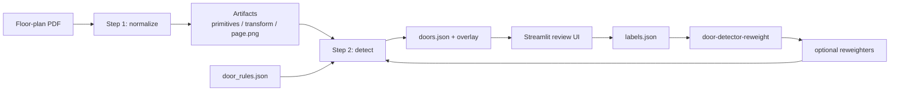

# Door Detector

Detects door symbols in vector architectural floor-plan PDFs, then lets a reviewer confirm, reject, or add doors in a Streamlit UI.

Built for CAD-style plans where doors are drawn as swing arcs, leaf lines, dashed pocket tracks, or bifold zig-zags—not for scanned raster-only sheets.

## Overview

Floor-plan PDFs store door geometry as vector primitives. This project turns those primitives into door candidates with a two-step pipeline:

1. **Step 1** rasterizes a page and extracts lines, Beziers, and related primitives into pixel-space artifacts (`primitives.json`, `transform.json`, `page.png`).
2. **Step 2** proposes candidates with geometric rules (circle-fit arcs, leaf pairing, spatial indexing, NMS/dedupe), optionally re-scores them with a small logistic model trained from review labels, and writes `doors.json`.

A Streamlit review app wraps the pipeline: upload a PDF, run analysis, inspect overlays in a bundled PDF.js viewer, label results, and retrain per-door-type reweighters locally.

## Highlights

- Geometry-first detection for swing, double, pocket, and bifold doors, with thresholds in `configs/door_rules.json`.
- Broad candidate pool plus stricter final `doors` list so missed doors can still be snapped/labeled during review.
- Handles drafting variation such as Bezier arcs vs polyline (including dashed) arc approximations.
- Human-in-the-loop labels (`labels.json` schema v4) feed `door-detector-reweight`, which fits per-type logistic reweighters without a deep-learning stack.
- Custom PDF.js Streamlit component for zoomable overlay review; prebuilt frontend assets are committed so Node is not required to run the app.

## Architecture



More detail: [`docs/ARCHITECTURE_DIAGRAM.md`](docs/ARCHITECTURE_DIAGRAM.md), [`docs/door_selection_process.md`](docs/door_selection_process.md).

**Stack:** Python 3.10+, PyMuPDF, NumPy, Pillow, Streamlit, TypeScript/React PDF.js viewer (Vite)

## Run locally

```bash
python3 -m venv venv
source venv/bin/activate
python3 -m pip install -e .
streamlit run door_detector/review_app.py
```

In the UI: upload a PDF you are allowed to process → **Analyze** → confirm/reject/delete detections, or **Edit Doors → Shift+drag** to add missed doors. Labels land under `artifacts/library/<file_id>/`.

CLI (optional):

```bash
door-detector-step1 inputs/plan.pdf --out artifacts/plan --dpi 400 --page-index 0
door-detector-step2 --artifacts artifacts/plan --config configs/door_rules.json
door-detector-reweight --artifacts artifacts --out-dir models
```

Point `configs/door_rules.json` → `reweighters` at locally trained models when you have them. See [`docs/retraining.md`](docs/retraining.md).

Floor-plan datasets and pretrained models are **not** shipped or linked here. Use documents you have permission to process. Local PDFs, review artifacts, and trained model JSON are gitignored.

Setup notes (venv troubleshooting, PDF.js rebuild): [`docs/SETUP.md`](docs/SETUP.md).

## Tests

Smoke test (synthetic PDF, no external data):

```bash
python3 tests/test_step2_smoke.py
```

Full suite:

```bash
python3 -m pip install -e ".[dev]"
pytest -q
```

Details: [`docs/TESTING.md`](docs/TESTING.md).

## Project layout

- `door_detector/pdf/` — render, vector extract, transforms, page-mode classify
- `door_detector/doors/` — detection, geometry, dedupe, overlays
- `door_detector/ui/` — Streamlit app and PDF.js component
- `door_detector/step1_pipeline.py`, `step2_pipeline.py` — CLI entrypoints
- `door_detector/reweight_fit.py` — train reweighters from labels
- `configs/door_rules.json` — thresholds and scoring
- `tests/` — unit and smoke tests
