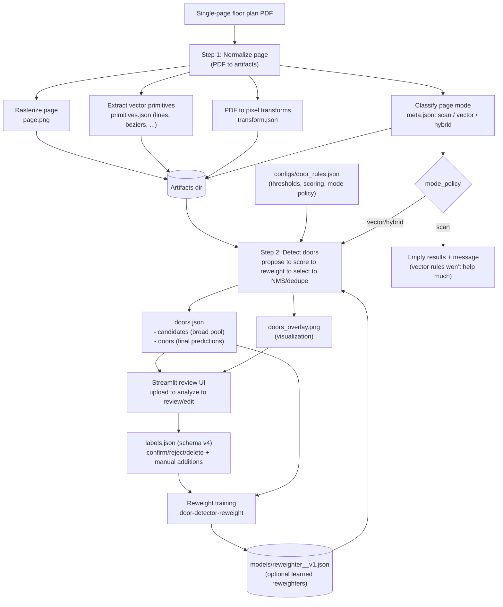

```mermaid
flowchart TD
  A["Single-page floor plan PDF"] --> B["Step 1: Normalize page<br/>(PDF to artifacts)"]

  B --> B1["Rasterize page<br/>page.png"]
  B --> B2["Extract vector primitives<br/>primitives.json (lines, beziers, ...)"]
  B --> B3["PDF to pixel transforms<br/>transform.json"]
  B --> B4["Classify page mode<br/>meta.json: scan / vector / hybrid"]

  B1 --> C[("Artifacts dir")]
  B2 --> C
  B3 --> C
  B4 --> C

  C --> D["Step 2: Detect doors<br/>propose to score to reweight to select to NMS/dedupe"]
  E["configs/door_rules.json<br/>(thresholds, scoring, mode policy)"] --> D
  F[("models/reweighter_<type>_v1.json<br/>(optional learned reweighters)")] --> D

  D --> G["doors.json<br/>- candidates (broad pool)<br/>- doors (final predictions)"]
  D --> H["doors_overlay.png<br/>(visualization)"]

  B4 --> I{"mode_policy"}
  I -->|vector/hybrid| D
  I -->|scan| J["Empty results + message<br/>(vector rules won’t help much)"]

  G --> K["Streamlit review UI<br/>upload to analyze to review/edit"]
  H --> K
  K --> L["labels.json (schema v4)<br/>confirm/reject/delete + manual additions"]

  L --> M["Reweight training<br/>door-detector-reweight"]
  G --> M
  M --> F
```
